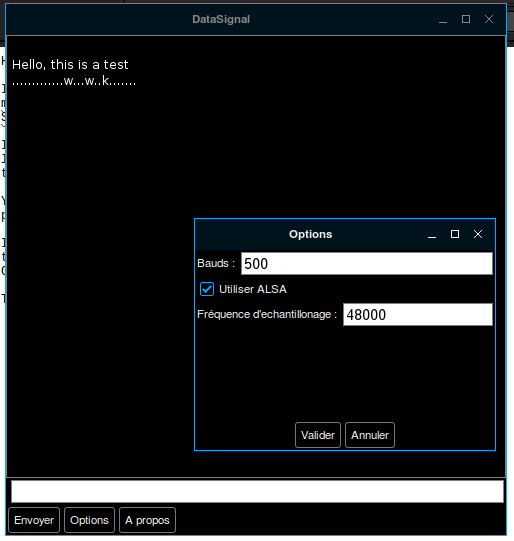

# Datasignal
## Presentation
Minimodem software (https://github.com/kamalmostafa/minimodem) is a command line tool written in C by Kamal Mostafa, which decodes (or generates) audio modem tones at any specified baud rate, using various framing protocols. It only works under GNU/Linux distributions for now.

Datasignal is a GUI written in Racket, to be use like a chat window. Of course it needs minimodem to works (see http://www.whence.com/minimodem/ for setup).

## Screenshot

## Additional informations
This is a very young but working project that I should translate in English soon. The goal is to create a perfect tool to communicate wirelessly between computers (chatting, sending file...), using radio transmitters.
